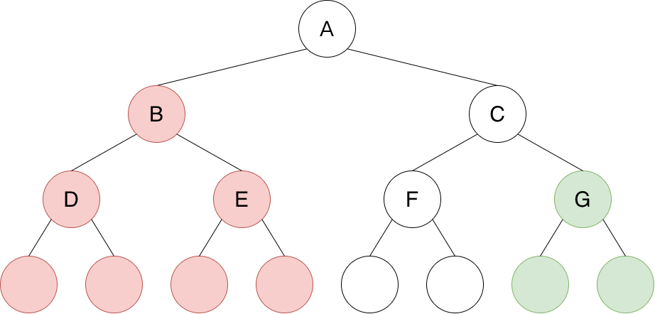
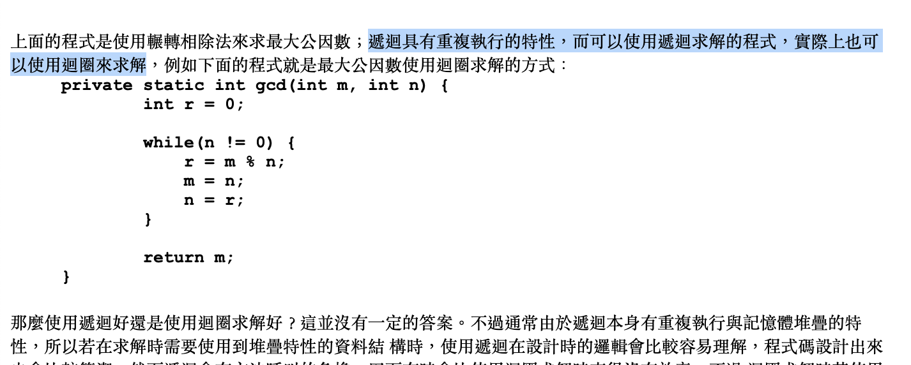
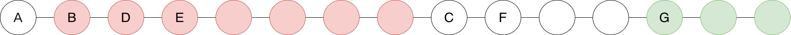
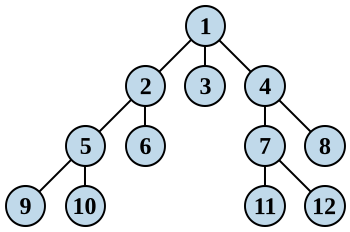
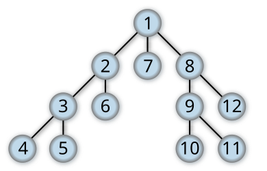

# Leetcode 100. Same Tree

## 難度：Easy

## 題目說明

題目會提供兩個樹節點，分別為 `p` 和 `q`，並要求我們撰寫一個函式，檢查 `p` 和 `q` 是否為相同的樹。

> 備註：若兩棵樹的結構與所有節點數值均相同，即視為相同的樹。

## 題目解析

### 方式一、遞迴法

#### 建議解答

```java
class Solution {
    public boolean isSameTree(TreeNode p, TreeNode q) {
        if (p == null) return q == null;
        if (q == null) return false;
        return isSameTree(p.left, q.left) && isSameTree(p.right, q.right) && (p.val == q.val);
    }
}
```

#### 說明

這題非常適合使用「遞迴（Recursion）」來處理。所謂遞迴，就是在方法中呼叫自己，因此很適合用於一些「重複性」的邏輯處理。




其中，每一個樹節點都可以視為一個獨立的「邏輯區塊」，如上圖，不論哪一個樹節點，其都是本身、左腳、右腳，即使是最末端，也是相同，只是其左腳，或右腳，或雙腳，為空。

因此我們可以將每一個樹節點都視作一個獨立且完整的全新單位來處理。

完整的實作程式碼如下：

```java
class Solution {
    public boolean isSameTree(TreeNode p, TreeNode q) {
        if (p == null && q == null) return true;
        else if (p == null) return false;
        else if (q == null) return false;
        else if (p.val != q.val) return false;
        return isSameTree(p.left, q.left) && isSameTree(p.right, q.right);
    }
}
```

有點類似抓對廝殺的概念，王對王，將對將，兵對兵。

首先，先看王，以上圖 B 和 C 為例，所以，B 先和 C 比數值，如果相同，就其各自有沒有左右腳，以本例來說，B 和 C 都是有左右腳，所以讓 D 跟 F 去比，並也讓 E 跟 G 去比，然後循環，直到終點，或是不相同的情況出現。

不過上述程式碼略顯冗餘，我們稍微將它優化，如下：

```java
class Solution {
    public boolean isSameTree(TreeNode p, TreeNode q) {
        if (p == null) return q == null;
        if (q == null) return false;
        return isSameTree(p.left, q.left) && isSameTree(p.right, q.right) && (p.val == q.val);
    }
}
```

### 方式二、迴圈法

#### 建議解答

```java
/**
 * Definition for a binary tree node.
 * public class TreeNode {
 *     int val;
 *     TreeNode left;
 *     TreeNode right;
 *     TreeNode() {}
 *     TreeNode(int val) { this.val = val; }
 *     TreeNode(int val, TreeNode left, TreeNode right) {
 *         this.val = val;
 *         this.left = left;
 *         this.right = right;
 *     }
 * }
 */
class Solution {
    public boolean isSameTree(TreeNode p, TreeNode q) {
        Stack<TreeNode> pTrees = new Stack<>(), qTrees = new Stack<>();
        pTrees.push(p);
        qTrees.push(q);

        while (!pTrees.empty() && !qTrees.empty()) {
            TreeNode currP = pTrees.pop();
            TreeNode currQ = qTrees.pop();
            if (currP == null && currQ == null) continue;
            else if (currP == null || currQ == null) return false;
            else if (currP.val != currQ.val) return false;

            pTrees.push(currP.left);
            pTrees.push(currP.right);
            qTrees.push(currQ.left);
            qTrees.push(currQ.right);
        }
        return true;
    }
}
```

#### 說明

前一節提到，「遞迴」很適合用於一些「重複性」的邏輯處理；那麼可以改用「迴圈」嗎？

當然可以；在良葛格的「[遞迴方法](https://openhome.cc/Gossip/JavaGossip-V1/RecursionMethod.htm)」一文中就有提到：「遞迴具有重複執行的特性，而可以使用遞迴求解的程式，實際上也可以使用迴圈來求解。」，如下：



那該怎麼做呢？

試想，如果我們能將一棵「二元樹」的所有樹節點，按照某種演算規則轉換成「線性結構」，如下圖：



至於上述的「某種規則」，其實就是「樹的遍歷」；所謂「樹的遍歷」，指的是按照某種規則，不重複地走訪一棵樹所有節點的過程。

一般來說，「樹的遍歷」可以分為「廣度優先搜尋」與「深度優先搜尋」。

首先，「廣度優先搜尋」（Breadth-first Search，簡稱 BFS），概念是以橫向來遍歷樹，如下：



接著是「深度優先搜尋」（Depth-first Search，簡稱 DFS），概念是以縱向來遍歷樹，如下：



其中，「深度優先搜尋」還會依走訪節點的先後順序，再細分為「Pre-order」、「In-order」與「Post-order」；而「廣度優先搜尋」則是逐層走訪，一般稱為 level-order。

但不管是哪種方式，其目的都是將樹變成線性。

本文採用的是「Pre-order」，其規則是「先記錄目前節點，再往左走訪，最後往右走訪」，也就是「根 → 左子樹 → 右子樹」。舉例來說，假設根節點是 A，A 的左子節點 B 底下還有 D、E 兩個子節點，A 的右子節點是 C，那麼經過 Pre-order 攝平後的序列就會是 A、B、D、E、C。

接著，當「二元樹」結構都轉成「線性」結構後，若我們想比較兩棵二元樹是否一致，只需將兩者線性結構中的每一個節點「逐一比較」即可，程式碼實作如下：

```java
/**
 * Definition for a binary tree node.
 * public class TreeNode {
 *     int val;
 *     TreeNode left;
 *     TreeNode right;
 *     TreeNode() {}
 *     TreeNode(int val) { this.val = val; }
 *     TreeNode(int val, TreeNode left, TreeNode right) {
 *         this.val = val;
 *         this.left = left;
 *         this.right = right;
 *     }
 * }
 */
class Solution {
    public boolean isSameTree(TreeNode p, TreeNode q) {
        Stack<TreeNode> pTrees = preOrder(p), qTrees = preOrder(q);
        if (pTrees.size() != qTrees.size()) return false;
        Iterator<TreeNode> pIterator = pTrees.iterator(), qIterator = qTrees.iterator();
        while (pIterator.hasNext()) {
            TreeNode pNode = pIterator.next(), qNode = qIterator.next();
            if (pNode == null && qNode != null || qNode == null && pNode != null || pNode != null && pNode.val != qNode.val)
                return false;
        }
        return true;
    }

    public Stack<TreeNode> preOrder(TreeNode root) {
        Stack<TreeNode> rootTrees = new Stack<>(), orderTrees = new Stack<>();
        rootTrees.push(root);
        while (!rootTrees.isEmpty()) {
            TreeNode currNode = rootTrees.pop();
            orderTrees.push(currNode);
            if (currNode != null) {
                rootTrees.push(currNode.right);
                rootTrees.push(currNode.left);
            }
        }
        return orderTrees;
    }
}
```

別怕，雖然程式碼看起來非常長！

但其實就是兩個部分：第一部分是逐一比較兩棵「二元樹」線性結構中的每一個節點。

而關鍵方法就是程式碼中的 `preOrder()`，其功能是遍歷「二元樹」，並建立該「二元樹」的「線性結構」；雖然程式碼稍微笨重了一點，但其實並不難理解，放幾棵「二元樹」印出來看一下，就能清楚它的處理過程了。

接著，同樣地，我們也將上述程式碼改寫一下，讓它更簡潔，優化的結果請見本解析的建議解答。

最後，我們來談談「遞迴」與「迴圈」該怎麼選擇？

同樣引用良葛格在「[遞迴方法](https://openhome.cc/Gossip/JavaGossip-V1/RecursionMethod.htm)」一文中的敍述：「那麼使用遞迴好還是使用迴圈求解好？這並沒有一定的答案。不過通常由於遞迴本身有重複執行與記憶體堆疊的特性，所以若在求解時需要使用到堆疊特性的資料結構時，使用遞迴在設計時的邏輯會比較容易理解，程式碼設計出來也會比較簡潔；然而遞迴會有方法呼叫的負擔，因而有時會比使用迴圈求解時來得沒有效率，不過迴圈求解時若使用到堆疊，通常在程式碼上會比較複雜。」。

簡單直白地說就是：對於某些適用「遞迴」的情況，我們仍然可以藉由「迴圈」來處理，但這種方式可能會讓程式邏輯變得相對複雜；而若以「遞迴」方式處理，則一不小心就可能因為遞迴過深而產生「StackOverflowError」的副作用。

事實上，在工作上，除非確實有需要，否則多數團隊會傾向謹慎使用「遞迴」——常見的做法是避免過深的遞迴、或限制遞迴深度，必要時改以迴圈實作。畢竟程式邏輯複雜的代價不過是可讀性較差、維護較費時，但一旦遞迴過深導致「StackOverflowError」，可是會讓系統崩潰的！

## 參考資料

- [林信良，遞迴方法](https://openhome.cc/Gossip/JavaGossip-V1/RecursionMethod.htm)
